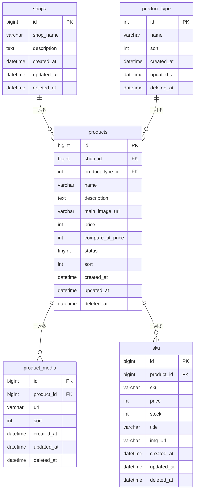

# 商品中心（Product Center）数据库设计文档

---

## 一、DDL 建表语句

```sql
-- 1. 店铺表
create table shops
(
    id          bigint auto_increment comment '主键id'
        primary key,
    shop_name   varchar(255) not null comment '商店名称',
    description text         null comment '商店描述',
    created_at  datetime     null comment '创建时间',
    updated_at  datetime     null comment '修改时间',
    deleted_at  datetime     null comment '软删除时间'
) comment '商店表';

create index idx_shop_name
    on shops (shop_name);


-- 2. 商品类型表
create table product_type
(
    id         int auto_increment comment '主键'
        primary key,
    name       varchar(500)  not null comment '分类名称',
    sort       int default 0 not null comment '分类排序',
    created_at datetime      not null comment '创建时间',
    updated_at datetime      not null comment '修改时间',
    deleted_at datetime      null comment '软删除时间'
) comment '商品类别';

create index product_type_sort_index
    on product_type (sort);


-- 3. 商品表
create table products
(
    id           bigint auto_increment comment '主键id'
        primary key,
    shop_id      bigint       not null comment '商店id',
    product_type_id  int         null comment '商品类型',
    name       varchar(255)  not null comment '商品名称',
    description   text           null comment '商品描述',
    main_image_url   varchar(500)  not null comment '主商品图片',
    price            int     not null comment '商品价格',
    compare_at_price int          null comment '划线价',
    status         tinyint        not null default 0 comment '商品状态：0=草稿 1=上架 2=下架',
    sort          int default 0 not null comment '排序',
    created_at   datetime    not null comment '创建时间',
    updated_at   datetime    not null comment '修改时间',
    deleted_at   datetime     null comment '软删除时间'
);

create index products_shop_id_status_index
    on products (shop_id, status);

create index products_status_index
    on products (status);


-- 4. 商品副图表
create table product_media
(
    id         bigint auto_increment comment '主键id'
        primary key,
    product_id bigint        not null comment '商品id',
    url        varchar(500)  null comment '商品图片',
    sort       int default 0 not null comment '图片排序',
    created_at datetime      not null comment '创建日期',
    updated_at datetime      not null comment '更新日期',
    deleted_at datetime      null comment '软删除时间'
) comment '商品副图表';

create index product_media_product_id_index
    on product_media (product_id);


-- 5. 商品SKU表
create table sku
(
    id         bigint auto_increment comment '主键id'
        primary key,
    product_id bigint       not null comment '商品id',
    sku        varchar(255) not null comment '商品sku编码',
    price      int          null comment 'sku价格（分）',
    stock      int          null comment '库存',
    title      varchar(100) not null comment 'sku标题',
    img_url    varchar(500) null comment 'sku图',
    created_at datetime     null comment '创建时间',
    updated_at datetime     not null comment '更新时间',
    deleted_at datetime     null comment '软删除时间'
) comment '商品SKU';

create index sku_product_id_index
    on sku (product_id);
```

---

## 二、字段说明表格

### shops（店铺表）

| 字段 | 类型 | 可为空 | 默认值 | 为什么选这个类型 |
|---|---|---|---|---|
| id | bigint | NOT NULL | AUTO_INCREMENT | bigint 范围 -2^63~2^63-1，店铺即使做到上亿也够用。 |
| shop_name | varchar(255) | NOT NULL | — | 店铺名是变长字符串，用 varchar 比 char 省空间。 |
| description | text | NULL | — | text 最多可存 65535 字符 |
| created_at | datetime | NULL | — | gorm.model里的三个字段映射是datetime，所以直接用了 |
| updated_at | datetime | NULL | — | 同上 |
| deleted_at | datetime | NULL | — | 同上。软删除标记。NULL=未删，有值=软删除时间。 |

### product_type（商品类型表）

| 字段 | 类型 | 可为空 | 默认值 | 为什么选这个类型 |
|---|---|---|---|---|
| id | int | NOT NULL | AUTO_INCREMENT | 理由同上个表 |
| name | varchar(500) | NOT NULL | — | 同上 |
| sort | int | NOT NULL | 0 | 排序字段用整数表示，default 0 保证有默认顺序 |
| created_at | datetime | NOT NULL | — | 同上 shops 理由 |
| updated_at | datetime | NOT NULL | — | 同上 |
| deleted_at | datetime | NULL | — | 同上 |

### products（商品表）

| 字段 | 类型 | 可为空 | 默认值 | 为什么选这个类型 |
|---|---|---|---|---|
| id | bigint | NOT NULL | AUTO_INCREMENT | 同上 |
| shop_id | bigint | NOT NULL | — | 逻辑外键，类型和 shops.id 一致 |
| product_type_id | int | NULL | — | 逻辑外键，类型与 product_type.id一致。 |
| name | varchar(255) | NOT NULL | — | 同上 |
| description | text | NULL | — | 同上 |
| main_image_url | varchar(500) | NOT NULL | — | URL 长度不可控，500 字符应该够用 |
| price | int | NOT NULL | — | 用 int 存分，避免精度问题 |
| compare_at_price | int | NULL | — | 划线价 |
| status | tinyint | NOT NULL | 0 | 商品状态，用tinyint比int字节占用少 |
| sort | int | NOT NULL | 0 | 排序字段用整数表示，default 0 保证有默认顺序 |
| created_at | datetime | NOT NULL | — | 理由同上 |
| updated_at | datetime | NOT NULL | — | 同上 |
| deleted_at | datetime | NULL | — | 同上 |

### product_media（商品副图表）

| 字段 | 类型 | 可为空 | 默认值 | 为什么选这个类型 |
|---|---|---|---|---|
| id | bigint | NOT NULL | AUTO_INCREMENT | 同上表 |
| product_id | bigint | NOT NULL | — | 逻辑外键，类型与 products.id一致 |
| url | varchar(500) | NULL | — | 图片地址，500 字符够用 |
| sort | int | NOT NULL | 0 | 同上表理由 |
| created_at | datetime | NOT NULL | — | 同上 |
| updated_at | datetime | NOT NULL | — | 同上 |
| deleted_at | datetime | NULL | — | 同上 |

### sku（商品SKU表）

| 字段 | 类型 | 可为空 | 默认值 | 为什么选这个类型 |
|---|---|---|---|---|
| id | bigint | NOT NULL | AUTO_INCREMENT | 同上 |
| product_id | bigint | NOT NULL | — | 逻辑外键，类型与 products.id 一致 |
| sku | varchar(255) | NOT NULL | — | 商品sku编码，比255小很多 |
| price | int | NULL | — | 与 products.price 类型一致，用 int 存分。 |
| stock | int | NULL | — | int 最大 21 亿，正常库存不会超过这个数。可空表示暂未设置 |
| title | varchar(100) | NOT NULL | — | SKU 标题 |
| img_url | varchar(500) | NULL | — | SKU 专属图，可空表示复用商品主图 |
| created_at | datetime | NULL | — | 记录创建时间 |
| updated_at | datetime | NOT NULL | — | 记录修改时间 |
| deleted_at | datetime | NULL | — | 软删除 |

---

## 三、索引设计说明

| 索引名 | 所属表 | 字段 | 加速哪个查询 |
|---|---|---|---|
| **idx_shop_name** | shops | shop_name | 按名称搜索店铺 |
| **product_type_sort_index** | product_type | sort | 类型列表按排序展示 |
| **products_shop_id_status_index** | products | shop_id, status | 查某个店铺的"某状态"商品 |
| **products_status_index** | products | status | 按状态筛选商品 |
| **product_media_product_id_index** | product_media | product_id | 查某个商品的所有副图 |
| **sku_product_id_index** | sku | product_id | 查某个商品的所有 SKU |

---

## 四、ER 关系图（这个我让ai帮我画的）



```
关系总结：

  shops ────→ products       : 一个店铺有多个商品，一个商品属于一个店铺
  product_type ──→ products  : 一个类型下有多个商品，一个商品属于一个类型
  products ────→ product_media : 一个商品有多张副图
  products ────→ sku          : 一个商品有多个 SKU 变体
```

---

## 五、设计思考题解答

### 1. 商品和店铺是什么关系？一对多还是多对多？

我设计的方案是一对多。一个店铺可以有多个商品，但一个商品只能属于一个店铺。但我使用平台的时候发现两个完全相同的商品，在点石上的商品id也不一致，我们平台应该是通过中间表和独立id来做的吧。

### 2. 商品列表查出来后，怎么把对应的店铺名称也查出来？有几种方案？（提示：JOIN、子查询、先查商品再批量查店铺、冗余字段……）

这几种我通过业务层先查商品再批量查店铺和用冗余字段比较多，业务层查两次会比其他的多一次io，冗余字段如果店铺商品特别多，维护成本太高，子查询性能不高，join应该是最优的，但我用gorm的时候没怎么写过这个。
### 3. 如果店铺被删了，它下面的商品应该怎么办？

我觉得可以有两种，一可以加层校验，如果有商品就必须把所有商品都删掉才能删掉店铺，二是加层警告，比如确定要删除吗，删除无法恢复，如果确定就直接级联删除了。

### 4. 删除商品是物理删除还是软删除？为什么？

软删除，通过deleted_at实现，值为null证明没删除，有值说明软删除了，加了一层回溯机制，可以加一个回收站，deleted_at有值的就放进去，误删代价小。我上。

### 5. 价格用什么类型？`DECIMAL`、`FLOAT`、还是 `INT`（存分）？各自的优缺点？

用int类型存分，存储的时候x100取的时候➗100。

float和double会有精度丢失问题
decimal存储字节过大

varchar不能实时计算

### 6. 商品状态用 VARCHAR 还是 TINYINT？

用tinyint，商品状态一般会加索引，用varchar可能出现隐式转换问题导致索引失效。

### 7. 查询商品列表通常需要支持"按店铺筛选"，这个查询需要什么索引？

shop_id 单列索引,但我采用了shop_id, status联合索引，一是贴近业务，搜索时一般会一起查，二是节省维护成本，不需要单独为shop_id生成索引，因为联合索引最左单独查询也会走索引。
---

## 六、验证：写一条真实的 SQL

```sql
-- 需求：查第 1 页商品，每页 10 条，带上店铺名称，按创建时间倒序
SELECT
    p.id,
    p.name,
    p.price,
    p.main_image_url,
    p.status,
    s.shop_name,
    pt.name AS product_type_name
FROM products p
LEFT JOIN shops s ON p.shop_id = s.id
LEFT JOIN product_type pt ON p.product_type_id = pt.id
WHERE p.deleted_at IS NULL
  AND p.status = 1
ORDER BY  p.created_at DESC
LIMIT 10 OFFSET 0;
```
