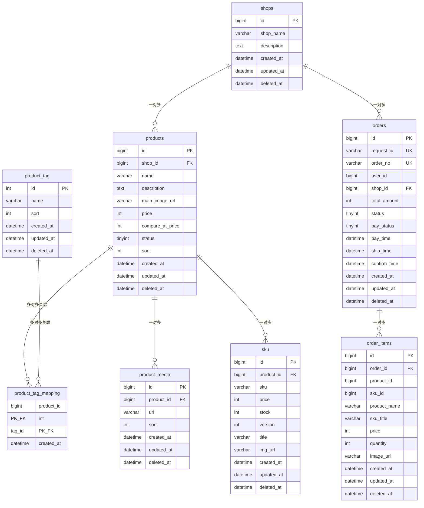

# 商品中心（Product Center）数据库设计文档

---

## 一、DDL 建表语句

```sql
-- 1. 店铺表
create table shops
(
    id          bigint auto_increment comment '主键id'
        primary key,
    shop_name   varchar(255) not null comment '商店名称',
    description text         null comment '商店描述',
    created_at  datetime     null comment '创建时间',
    updated_at  datetime     null comment '修改时间',
    deleted_at  datetime     null comment '软删除时间'
) comment '商店表';

create index idx_shop_name
    on shops (shop_name);


-- 2. 商品标签表
create table product_tag
(
    id         int auto_increment comment '主键'
        primary key,
    name       varchar(500)  not null comment '标签名称',
    sort       int default 0 not null comment '排序',
    created_at datetime      not null comment '创建时间',
    updated_at datetime      not null comment '修改时间',
    deleted_at datetime      null comment '软删除时间'
) comment '商品标签表';

create index idx_product_tag_sort
    on product_tag (sort);


-- 3. 商品表
create table products
(
    id               bigint auto_increment comment '主键id'
        primary key,
    shop_id          bigint        not null comment '商店id（逻辑外键）',
    name             varchar(255)  not null comment '商品名称',
    description      text          null comment '商品描述',
    main_image_url   varchar(500)  not null comment '主商品图片',
    price            int           not null comment '售价（分）',
    compare_at_price int           null comment '划线价（分）',
    status           tinyint       not null default 0 comment '状态：0=草稿 1=上架 2=下架',
    sort             int default 0 not null comment '排序',
    created_at       datetime      not null comment '创建时间',
    updated_at       datetime      not null comment '修改时间',
    deleted_at       datetime      null comment '软删除时间'
);

create index idx_products_shop_status
    on products (shop_id, status);

create index idx_products_status
    on products (status);


-- 4. 商品副图表
create table product_media
(
    id         bigint auto_increment comment '主键id'
        primary key,
    product_id bigint        not null comment '商品id（逻辑外键）',
    url        varchar(500)  null comment '图片url',
    sort       int default 0 not null comment '图片排序',
    created_at datetime      not null comment '创建日期',
    updated_at datetime      not null comment '更新日期',
    deleted_at datetime      null comment '软删除时间'
) comment '商品副图表';

create index idx_media_product
    on product_media (product_id);


-- 5. 商品标签关联表（多对多）
create table product_tag_mapping
(
    product_id bigint  not null comment '商品id（逻辑外键）',
    tag_id     int     not null comment '标签id（逻辑外键）',
    created_at datetime null comment '创建时间',
    primary key (product_id, tag_id)
) comment '商品-标签关联表';

create index idx_tag_mapping_product
    on product_tag_mapping (product_id);

create index idx_tag_mapping_tag
    on product_tag_mapping (tag_id);


-- 6. 商品SKU表
create table sku
(
    id         bigint auto_increment comment '主键id'
        primary key,
    product_id bigint       not null comment '商品id（逻辑外键）',
    sku        varchar(255) not null comment 'sku编码',
    price      int          null comment '价格（分）',
    stock      int          null comment '库存',
    version    int          not null default 0 comment '乐观锁版本号',
    title      varchar(100) not null comment 'sku标题',
    img_url    varchar(500) null comment 'sku图',
    created_at datetime     null comment '创建时间',
    updated_at datetime     not null comment '更新时间',
    deleted_at datetime     null comment '软删除时间'
) comment '商品SKU表';

create index idx_sku_product
    on sku (product_id);


-- 7. 订单表
create table orders
(
    id           bigint auto_increment comment '主键id'
        primary key,
    request_id   varchar(64)  not null comment '幂等请求id',
    order_no     varchar(64)  not null comment '订单编号',
    user_id      bigint       not null comment '用户id',
    shop_id      bigint       not null comment '店铺id（逻辑外键）',
    total_amount int          not null default 0 comment '订单总金额（分）',
    status       tinyint      not null default 0 comment '订单状态：0=待处理 1=待支付 2=待发货 3=待完成 4=已完成 5=已取消 6=失败',
    pay_status   tinyint      not null default 0 comment '支付状态：0=未支付 1=已支付 2=支付失败 3=退款中 4=已退款',
    pay_time     datetime     null comment '支付时间',
    ship_time    datetime     null comment '发货时间',
    confirm_time datetime     null comment '确认收货时间',
    created_at   datetime     not null comment '创建时间',
    updated_at   datetime     not null comment '修改时间',
    deleted_at   datetime     null comment '软删除时间'
) comment '订单表';

create unique index idx_orders_request_id
    on orders (request_id);

create unique index idx_orders_order_no
    on orders (order_no);

create index idx_orders_user_id
    on orders (user_id);

create index idx_orders_shop_id
    on orders (shop_id);


-- 8. 订单项表
create table order_items
(
    id           bigint auto_increment comment '主键id'
        primary key,
    order_id     bigint       not null comment '订单id（逻辑外键）',
    product_id   bigint       not null comment '商品id',
    sku_id       bigint       not null comment 'sku id',
    product_name varchar(255) not null comment '商品名称（冗余快照）',
    sku_title    varchar(255) null comment 'sku标题（冗余快照）',
    price        int          not null comment '下单时单价（分）',
    quantity     int          not null comment '购买数量',
    image_url    varchar(512) null comment '商品图片快照',
    created_at   datetime     not null comment '创建时间',
    updated_at   datetime     not null comment '修改时间',
    deleted_at   datetime     null comment '软删除时间'
) comment '订单项表';

create index idx_order_items_order_id
    on order_items (order_id);
```

---

## 二、字段说明表格

### shops（店铺表）

| 字段 | 类型 | 可为空 | 默认值 | 为什么选这个类型 |
|---|---|---|---|---|
| id | bigint | NOT NULL | AUTO_INCREMENT | bigint 范围 -2^63~2^63-1，店铺即使做到上亿也够用。 |
| shop_name | varchar(255) | NOT NULL | — | 店铺名是变长字符串，用 varchar 比 char 省空间。 |
| description | text | NULL | — | text 最多可存 65535 字符 |
| created_at | datetime | NULL | — | gorm.model里的三个字段映射是datetime，所以直接用了 |
| updated_at | datetime | NULL | — | 同上 |
| deleted_at | datetime | NULL | — | 同上。软删除标记。NULL=未删，有值=软删除时间。 |

### product_tag（商品标签表）

| 字段 | 类型 | 可为空 | 默认值 | 为什么选这个类型 |
|---|---|---|---|---|
| id | int | NOT NULL | AUTO_INCREMENT | 理由同上个表 |
| name | varchar(500) | NOT NULL | — | 标签名称，支持中文长文本 |
| sort | int | NOT NULL | 0 | 排序字段用整数表示，default 0 保证有默认顺序 |
| created_at | datetime | NOT NULL | — | 同上 shops 理由 |
| updated_at | datetime | NOT NULL | — | 同上 |
| deleted_at | datetime | NULL | — | 同上 |

### products（商品表）

| 字段 | 类型 | 可为空 | 默认值 | 为什么选这个类型 |
|---|---|---|---|---|
| id | bigint | NOT NULL | AUTO_INCREMENT | 同上 |
| shop_id | bigint | NOT NULL | — | 逻辑外键，类型和 shops.id 一致 |
| name | varchar(255) | NOT NULL | — | 商品名称 |
| description | text | NULL | — | 同上 |
| main_image_url | varchar(500) | NOT NULL | — | URL 长度不可控，500 字符应该够用 |
| price | int | NOT NULL | — | 用 int 存分，避免精度问题 |
| compare_at_price | int | NULL | — | 划线价 |
| status | tinyint | NOT NULL | 0 | 商品状态，用tinyint比int字节占用少 |
| sort | int | NOT NULL | 0 | 排序字段用整数表示，default 0 保证有默认顺序 |
| created_at | datetime | NOT NULL | — | 理由同上 |
| updated_at | datetime | NOT NULL | — | 同上 |
| deleted_at | datetime | NULL | — | 同上 |

### product_media（商品副图表）

| 字段 | 类型 | 可为空 | 默认值 | 为什么选这个类型 |
|---|---|---|---|---|
| id | bigint | NOT NULL | AUTO_INCREMENT | 同上表 |
| product_id | bigint | NOT NULL | — | 逻辑外键，类型与 products.id一致 |
| url | varchar(500) | NULL | — | 图片地址，500 字符够用 |
| sort | int | NOT NULL | 0 | 同上表理由 |
| created_at | datetime | NOT NULL | — | 同上 |
| updated_at | datetime | NOT NULL | — | 同上 |
| deleted_at | datetime | NULL | — | 同上 |

### product_tag_mapping（商品-标签关联表）

| 字段 | 类型 | 可为空 | 默认值 | 为什么选这个类型 |
|---|---|---|---|---|
| product_id | bigint | NOT NULL | — | 逻辑外键，与 products.id 一致。联合主键之一 |
| tag_id | int | NOT NULL | — | 逻辑外键，与 product_tag.id 一致。联合主键之一 |
| created_at | datetime | NULL | — | 关联创建时间 |

### sku（商品SKU表）

| 字段 | 类型 | 可为空 | 默认值 | 为什么选这个类型 |
|---|---|---|---|---|
| id | bigint | NOT NULL | AUTO_INCREMENT | 同上 |
| product_id | bigint | NOT NULL | — | 逻辑外键，类型与 products.id 一致 |
| sku | varchar(255) | NOT NULL | — | 商品sku编码，比255小很多 |
| price | int | NULL | — | 与 products.price 类型一致，用 int 存分 |
| stock | int | NULL | — | int 最大 21 亿，正常库存不会超过这个数。可空表示暂未设置 |
| version | int | NOT NULL | 0 | 乐观锁版本号，并发扣减库存时保证数据一致性 |
| title | varchar(100) | NOT NULL | — | SKU 标题 |
| img_url | varchar(500) | NULL | — | SKU 专属图，可空表示复用商品主图 |
| created_at | datetime | NULL | — | 记录创建时间 |
| updated_at | datetime | NOT NULL | — | 记录修改时间 |
| deleted_at | datetime | NULL | — | 软删除 |

### orders（订单表）

| 字段 | 类型 | 可为空 | 默认值 | 为什么选这个类型 |
|---|---|---|---|---|
| id | bigint | NOT NULL | AUTO_INCREMENT | 订单量可能很大，用 bigint |
| request_id | varchar(64) | NOT NULL | — | 幂等请求 ID，UUID 长度。唯一索引防重 |
| order_no | varchar(64) | NOT NULL | — | 订单编号，唯一索引 |
| user_id | bigint | NOT NULL | — | 用户 ID |
| shop_id | bigint | NOT NULL | — | 逻辑外键，类型与 shops.id 一致 |
| total_amount | int | NOT NULL | 0 | 订单总金额（分），int 避免精度问题 |
| status | tinyint | NOT NULL | 0 | 订单状态枚举，用 tinyint 节省空间 |
| pay_status | tinyint | NOT NULL | 0 | 支付状态枚举，用 tinyint 节省空间 |
| pay_time | datetime | NULL | — | 支付时间，可空表示未支付 |
| ship_time | datetime | NULL | — | 发货时间，可空表示未发货 |
| confirm_time | datetime | NULL | — | 确认收货时间，可空表示未确认 |
| created_at | datetime | NOT NULL | — | 创建时间 |
| updated_at | datetime | NOT NULL | — | 修改时间 |
| deleted_at | datetime | NULL | — | 软删除标记 |

### order_items（订单项表）

| 字段 | 类型 | 可为空 | 默认值 | 为什么选这个类型 |
|---|---|---|---|---|
| id | bigint | NOT NULL | AUTO_INCREMENT | 订单项量可能很大 |
| order_id | bigint | NOT NULL | — | 逻辑外键，类型与 orders.id 一致 |
| product_id | bigint | NOT NULL | — | 商品 ID，用于追溯 |
| sku_id | bigint | NOT NULL | — | SKU ID，用于追溯 |
| product_name | varchar(255) | NOT NULL | — | 冗余快照，下单时商品名称 |
| sku_title | varchar(255) | NULL | — | 冗余快照，下单时 SKU 标题 |
| price | int | NOT NULL | — | 下单时单价（分），历史快照不变 |
| quantity | int | NOT NULL | — | 购买数量 |
| image_url | varchar(512) | NULL | — | 商品图片快照 |
| created_at | datetime | NOT NULL | — | 创建时间 |
| updated_at | datetime | NOT NULL | — | 修改时间 |
| deleted_at | datetime | NULL | — | 软删除标记 |

---

## 三、索引设计说明

| 索引名 | 所属表 | 字段 | 加速哪个查询 |
|---|---|---|---|
| **idx_shop_name** | shops | shop_name | 按名称搜索店铺 |
| **idx_product_tag_sort** | product_tag | sort | 标签列表按排序展示 |
| **idx_products_shop_status** | products | shop_id, status | 查某个店铺的"某状态"商品 |
| **idx_products_status** | products | status | 按状态筛选商品 |
| **idx_media_product** | product_media | product_id | 查某个商品的所有副图 |
| **idx_tag_mapping_product** | product_tag_mapping | product_id | 查某个商品的所有标签 |
| **idx_tag_mapping_tag** | product_tag_mapping | tag_id | 查某个标签关联的所有商品 |
| **idx_sku_product** | sku | product_id | 查某个商品的所有 SKU |
| **idx_orders_request_id** | orders | request_id | 幂等防重，按 request_id 查订单 |
| **idx_orders_order_no** | orders | order_no | 按订单编号查询 |
| **idx_orders_user_id** | orders | user_id | 查某个用户的所有订单 |
| **idx_orders_shop_id** | orders | shop_id | 查某个店铺的所有订单 |
| **idx_order_items_order_id** | order_items | order_id | 查某个订单的所有订单项 |

---

## 四、ER 关系图（这个我让ai帮我画的）



```
关系总结：

  shops ────→ products           : 一个店铺有多个商品，一个商品属于一个店铺
  products ──→ product_tag_mapping : 一个商品可以关联多个标签
  product_tag ──→ product_tag_mapping : 一个标签可以被多个商品使用（多对多）
  products ────→ product_media    : 一个商品有多张副图
  products ────→ sku              : 一个商品有多个 SKU 变体
  shops ────→ orders             : 一个店铺有多个订单
  orders ────→ order_items       : 一个订单包含多个订单项
```

---

## 五、设计思考题解答

### 1. 商品和店铺是什么关系？一对多还是多对多？

我设计的方案是一对多。一个店铺可以有多个商品，但一个商品只能属于一个店铺。但我使用平台的时候发现两个完全相同的商品，在点石上的商品id也不一致，我们平台应该是通过中间表和独立id来做的吧。

### 2. 商品列表查出来后，怎么把对应的店铺名称也查出来？有几种方案？（提示：JOIN、子查询、先查商品再批量查店铺、冗余字段……）

这几种我通过业务层先查商品再批量查店铺和用冗余字段比较多，业务层查两次会比其他的多一次io，冗余字段如果店铺商品特别多，维护成本太高，子查询性能不高，join应该是最优的，但我用gorm的时候没怎么写过这个。
### 3. 如果店铺被删了，它下面的商品应该怎么办？

我觉得可以有两种，一可以加层校验，如果有商品就必须把所有商品都删掉才能删掉店铺，二是加层警告，比如确定要删除吗，删除无法恢复，如果确定就直接级联删除了。

### 4. 删除商品是物理删除还是软删除？为什么？

软删除，通过deleted_at实现，值为null证明没删除，有值说明软删除了，加了一层回溯机制，可以加一个回收站，deleted_at有值的就放进去，误删代价小。我上。

### 5. 价格用什么类型？`DECIMAL`、`FLOAT`、还是 `INT`（存分）？各自的优缺点？

用int类型存分，存储的时候x100取的时候➗100。

float和double会有精度丢失问题
decimal存储字节过大

varchar不能实时计算

### 6. 商品状态用 VARCHAR 还是 TINYINT？

用tinyint，商品状态一般会加索引，用varchar可能出现隐式转换问题导致索引失效。

### 7. 查询商品列表通常需要支持"按店铺筛选"，这个查询需要什么索引？

shop_id 单列索引,但我采用了 shop_id, status 联合索引，一是贴近业务，搜索时一般会一起查，二是节省维护成本，不需要单独为 shop_id 生成索引，因为联合索引最左前缀单独查 shop_id 也会走索引。

### 8. 商品和标签之间是什么关系？怎么设计？

我改成了多对多关系，通过 product_tag_mapping 中间表来关联。之前是一对多（一个商品只能属于一个类型），但实际业务中一个商品可能需要多个标签（比如"热销"、"新品"、"限时优惠"），用中间表可以灵活组合标签。

### 9. 为什么要用乐观锁（version 字段）而不是 SELECT FOR UPDATE 来扣减库存？

- 乐观锁无锁等待，并发性能高
- 库存扣减冲突率低，适合乐观锁
- MySQL 默认隔离级别 REPEATABLE-READ 下，乐观锁更可控
- 扣减 SQL 同时校验 `version` 和 `stock >= ?`，版本不匹配则重试（最多 3 次）

### 10. orders 表的 request_id 为什么要加唯一索引？

订单创建需要幂等保护，防止用户重复提交。request_id 唯一索引是最底层的原子性保证：
- Redis SET NX：快速判断（第一层）
- DB 查询 request_id 是否存在：Redis 不可用时的兜底（第二层）
- UNIQUE 索引：最终防线，任何绕过前两层的情况都会被唯一索引拦截

### 11. order_items 为什么要冗余 product_name、sku_title、image_url？

这是典型的"快照"设计——下单时把商品名、SKU 标题、商品图存一份在订单项里。即使后续商品改名、SKU 标题修改、图片更换，历史订单仍然能看到下单时的原始信息，不会跟着变。
---

## 六、验证：写一条真实的 SQL

```sql
-- 需求：查第 1 页商品，每页 10 条，带上店铺名称和标签，按创建时间倒序
SELECT
    p.id,
    p.name,
    p.price,
    p.main_image_url,
    p.status,
    s.shop_name,
    GROUP_CONCAT(pt.name SEPARATOR ',') AS tag_names
FROM products p 
LEFT JOIN shops s ON p.shop_id = s.id
LEFT JOIN product_tag_mapping ptm ON p.id = ptm.product_id
LEFT JOIN product_tag pt ON ptm.tag_id = pt.id
WHERE p.deleted_at IS NULL
  AND p.status = 1
GROUP BY p.id, p.name, p.price, p.main_image_url, p.status, s.shop_name
ORDER BY p.created_at DESC
LIMIT 10 OFFSET 0;
```

### 订单创建时 SKU 库存扣减 SQL（乐观锁）

```sql
-- 核心：WHERE version = ? AND stock >= ? 保证并发安全
UPDATE sku
SET stock = stock - ?, version = version + 1
WHERE id = ? AND version = ? AND stock >= ?;
```

`WHERE version = ?` 保证并发安全：读到的版本号和更新时不一致则失败重试。
